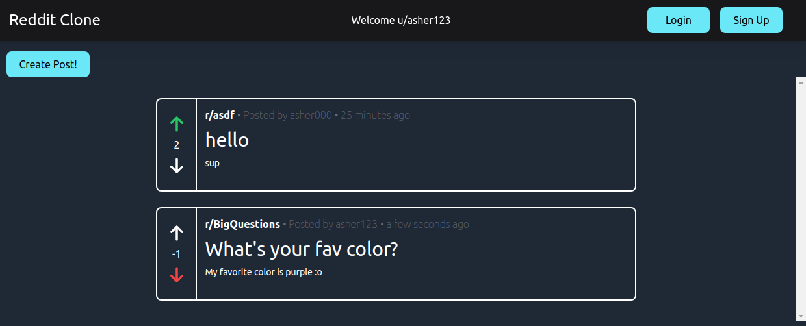
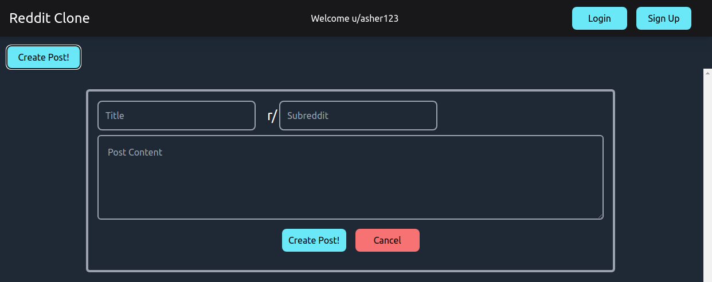
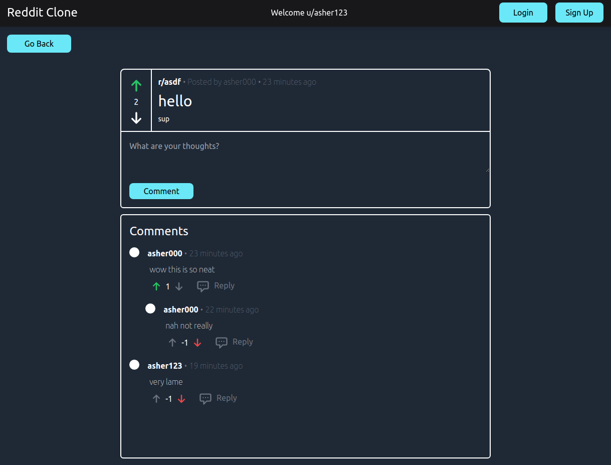

# Reddit Clone
I have been meaning to practice some new technologies so I decided to make a clone of Reddit.

## Frontend
- React (with TypeScript)
- TailwindCSS
- Apollo Client (GraphQL client, state management)

## Backend
- Go server (GraphQL interface using the gqlgen framework)
- DynamoDB using the Serverless Framework
- Amazon Cognito for user authentication

## Running Locally
I wrote a script, `run-local.sh`, which starts the React app, Go server, and DynamoDB instance. The script only runs on Ubuntu since it uses Gnome terminals.

## Pictures

